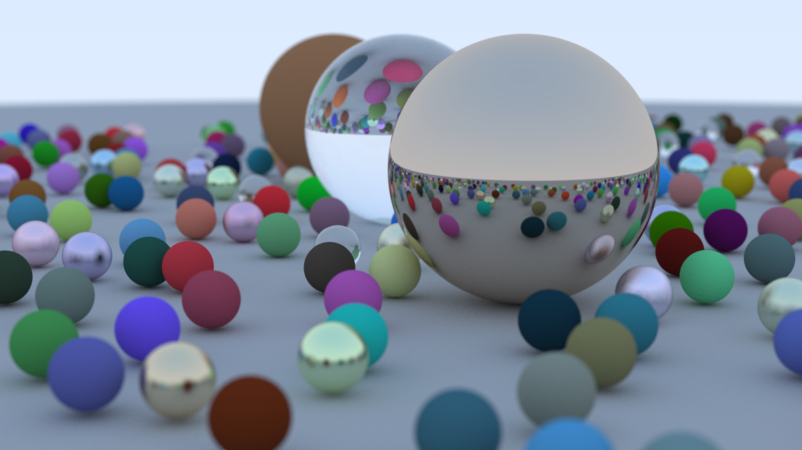

# Ray Tracing in One Weekend
This is based on the [_Ray Tracing in One Weekend_](https://raytracing.github.io/books/RayTracingInOneWeekend.html) book series by Peter Shirley, Trevor David Black and Steve Hollasch.
Only code related to the first book can be found right now.

## Final Render
Heres the final render I got. It took my PC over 30 minutes to finish 😭

## Future Plans
- Finish all 3 books
- Use CMake to avoid Visual Studio dependance
- Add a custom shape or material
